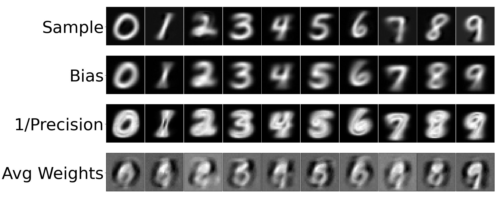

# Official Implementation of Neural Boltzmann Machines

This is the official implementation of Neural Boltzmann Machines (NBMs).



In this [paper](https://arxiv.org/abs/2305.08337) we present Neural Boltzmann Machines (NBMs) which are a new extension of 
Conditional Restricted Boltzmann Machines (CRBMs)
that allow CRBMs to take full advantage of the push to deeper and deeper networks. We accomplish
this by allowing all parameters of a CRBM to be their own neural network that is a function of the
conditional input. This flexibility allows us to use arbitrary neural networks to represent the bias and
variance of the visible units and the weights between visible and hidden units. This code repository demonstrates the how to train NBMs on MNIST and FashionMNIST for 
visible units that are either Gaussian or binary.

We provide some easy to use configurations that can reproduce key results from the paper.

```
python train.py --dataset_name MNIST --visible_unit_type gaussian          # Gaussian MNIST 
python train.py --dataset_name MNIST --visible_unit_type ising             # Binary MNIST 
python train.py --dataset_name FashionMNIST --visible_unit_type gaussian   # Gaussian FasionMNIST 
python train.py --dataset_name FashionMNIST --visible_unit_type ising      # Binary FashionMNIST 
```

Training time on a Mac M1 takes approximately 25 seconds per epoch for a total training time of 20 minutes.
